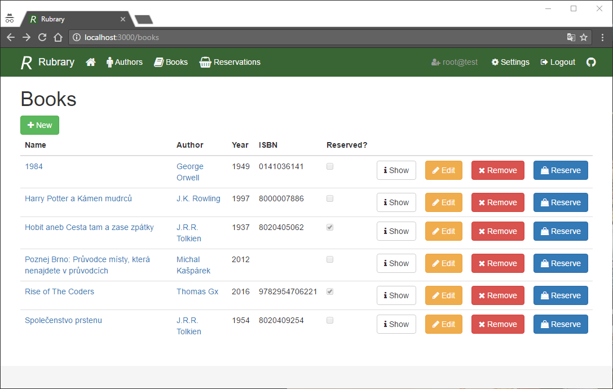

#Rubrary

Rubrary is an information system for the library. Here you can view information on specific books and authors from the system. Also, users can reserve these books for borrowing. Administrators can add and edit individual information.

The information system is written in [Ruby](https://www.ruby-lang.org) and the framework [Ruby on Rails](http://rubyonrails.org). Languages ​​<a href="https://www.w3.org/html/" title="Hyper Text Markup Language">HTML</a>, <a href="https://www.w3.org/Style/CSS/" title="Cascading Style Sheets">CSS</a> and <a href="https://developer.mozilla.org/en-US/docs/Web/JavaScript">JavaScript</a> are also used. The design of the system is rendered using the [Bootstrap](https://getbootstrap.com) framework. The sources of information are obtained from [PostgreSQL](https://www.postgresql.org) database and information about books and authors are loaded from the [Goodreads](https://www.goodreads.com).

